# MU CSE Society Portal

A modern full-stack university club management platform built for **MU CSE Society**.  
This project is designed to manage events, notices, committee members, alumni, blogs, user authentication, submissions, and admin operations in a clean and professional way.

---

## Project Overview

**MU CSE Society Portal** is a complete web-based society management system developed for the Computer Science & Engineering Society of a university.

The system includes:

- a **React frontend**
- a **Django backend**
- public pages for students and visitors
- an authenticated member area
- an admin control panel
- a submission review workflow
- dynamic content management for events, notices, blogs, alumni, and committee members

This portal is built not only as a functional system but also with a strong focus on:

- modern UI
- responsive design
- premium visual layout
- better organization of university club activities
- better communication between admin and members

---

## Main Objectives

The main goals of this project are:

1. To create a single digital platform for MU CSE Society
2. To make event, notice, and blog management easier
3. To allow students and members to access important updates quickly
4. To provide a dedicated admin system for content control
5. To support alumni and committee profile visibility
6. To allow authenticated users to manage their own profiles
7. To create a submission system where members can submit content for admin review

---

## Core Features

## Public Features

The public side of the website includes:

- Home page with featured sections
- About page
- Events page
- Event details page
- Notices page
- Notice details page
- Committee page
- Committee member details page
- Alumni page
- Alumni details page
- Blog page
- Blog details page
- Contact page
- Footer quick navigation
- Scroll-to-top navigation on page change

These pages are designed for all visitors and do not require login.

---

## Member Features

Authenticated members can:

- create an account
- login to the system
- access their own profile
- edit profile information
- upload profile image
- update social links
- change password
- use validation-protected account creation rules

The profile section is designed with a premium card-based layout and modern aesthetic UI.

---

## Submission Features

Members can submit content through dedicated submission pages:

- Submit Event
- Submit Notice
- Submit Blog
- Submit Alumni Entry

These submissions are not published instantly.  
They go to the admin review panel where they can be approved or rejected.

This helps keep the content organized and moderated.

---

## Admin Features

The admin area includes:

- Admin dashboard
- Manage users
- Manage events
- Manage notices
- Manage blogs
- Manage alumni
- Manage committee members
- Manage committee academic years
- Manage pending submissions
- Approve / reject submitted content

The admin system is protected using route-based access control on the frontend and admin APIs on the backend.

---

## UI / Design Highlights

This project is designed with a strong focus on modern and professional presentation.

Design highlights include:

- white + yellow + blue themed UI
- premium glass-like cards
- responsive layouts
- animated sections
- hover effects
- profile-style details pages
- reusable card system
- modern hero section
- clean dashboard layout
- footer navigation
- aesthetic visual hierarchy

The project aims to feel more like a modern production-ready university portal rather than a simple student project.

---

## Technology Stack

### Frontend
- React
- React Router DOM
- CSS
- React Icons
- Fetch API

### Backend
- Django
- Django ORM
- Django authentication system
- Session-based authentication
- SQLite (for local development)

### Other Tools
- Git
- GitHub
- VS Code

---

## Project Preview

### Home Page
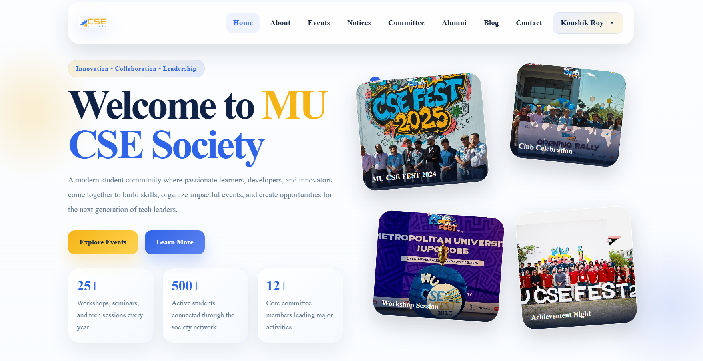

### About Page
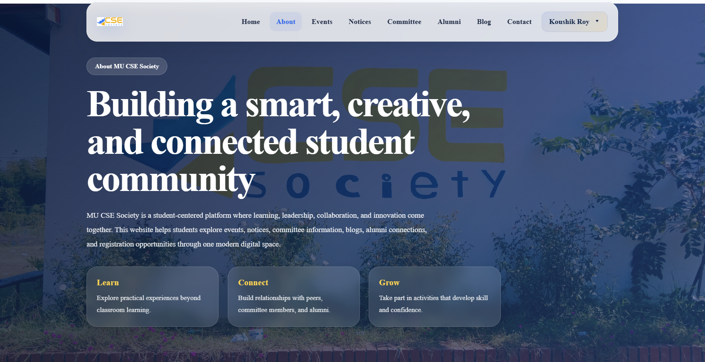

### Event Page
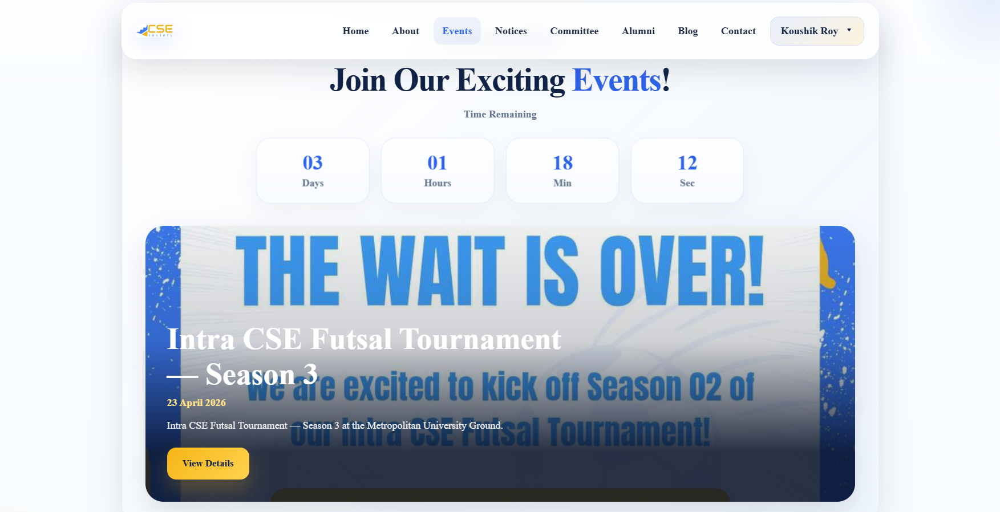

### Notice Page
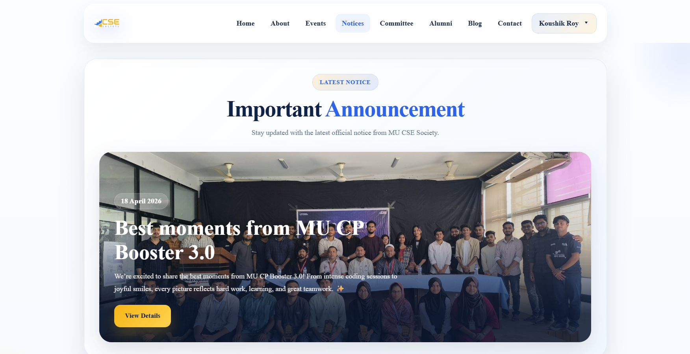

### Committee Page
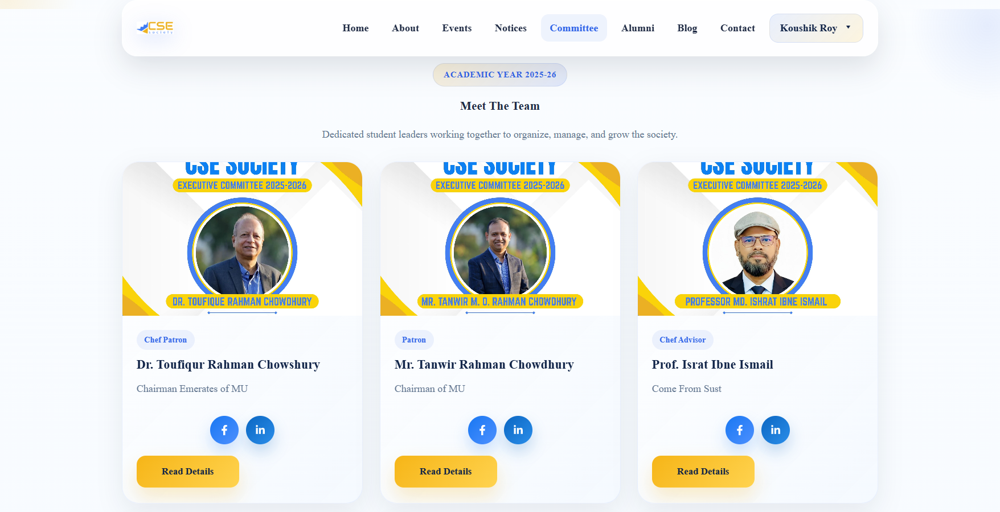

### Alumni Page
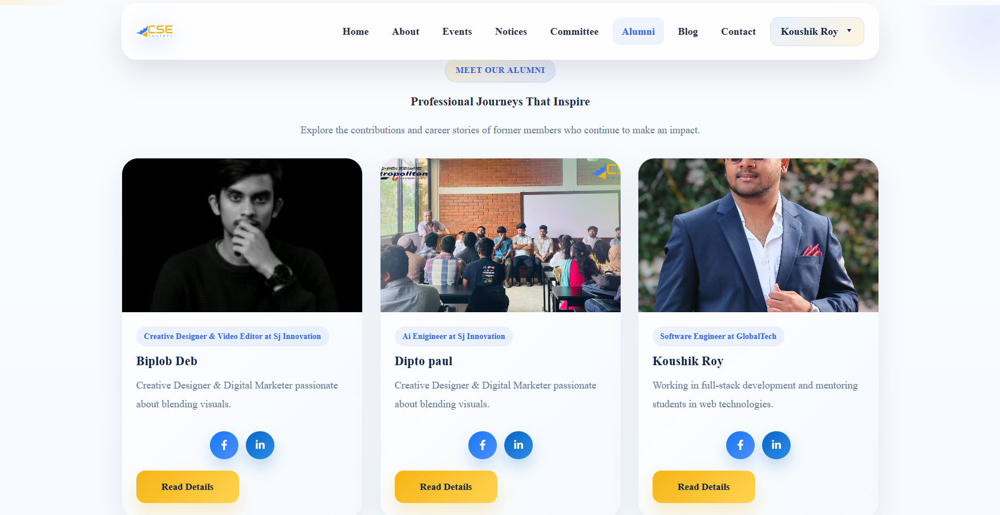

### Blog Page
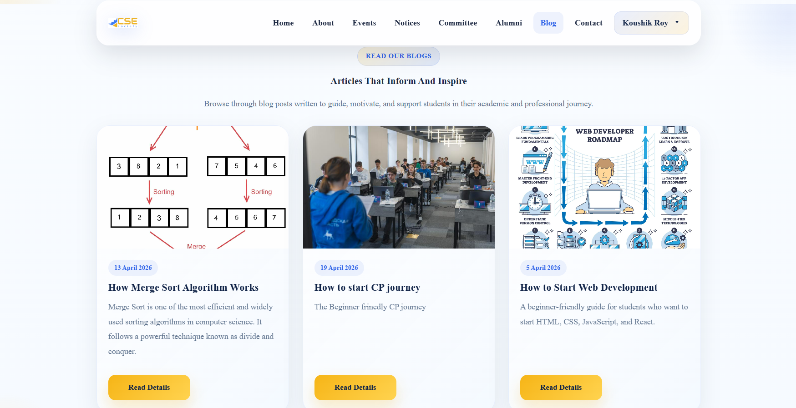

### Contact Page


### Login / Register
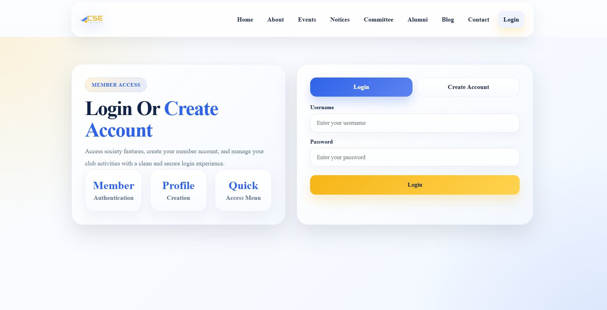

### Profile Page
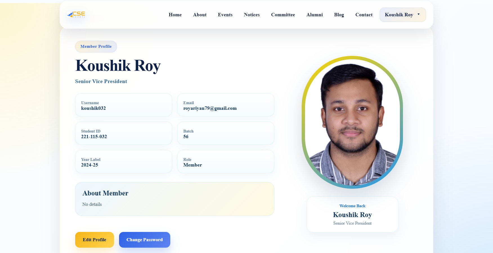

### Admin Dashboard
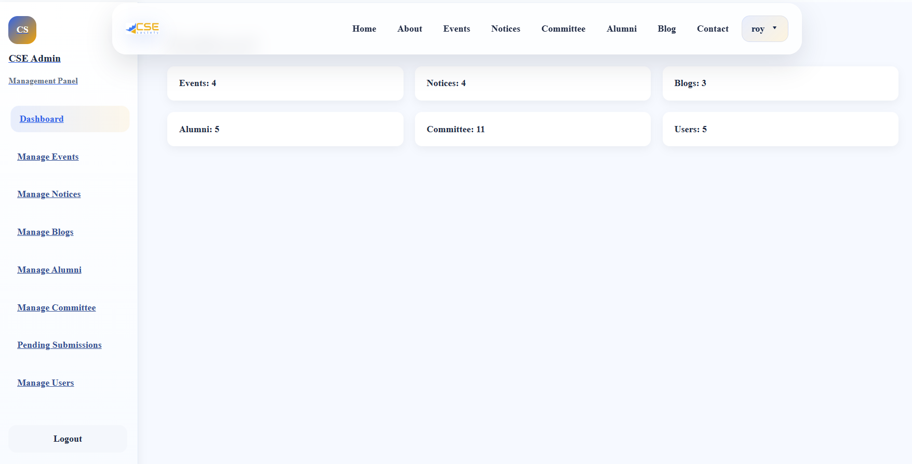

### Admin Manage Event
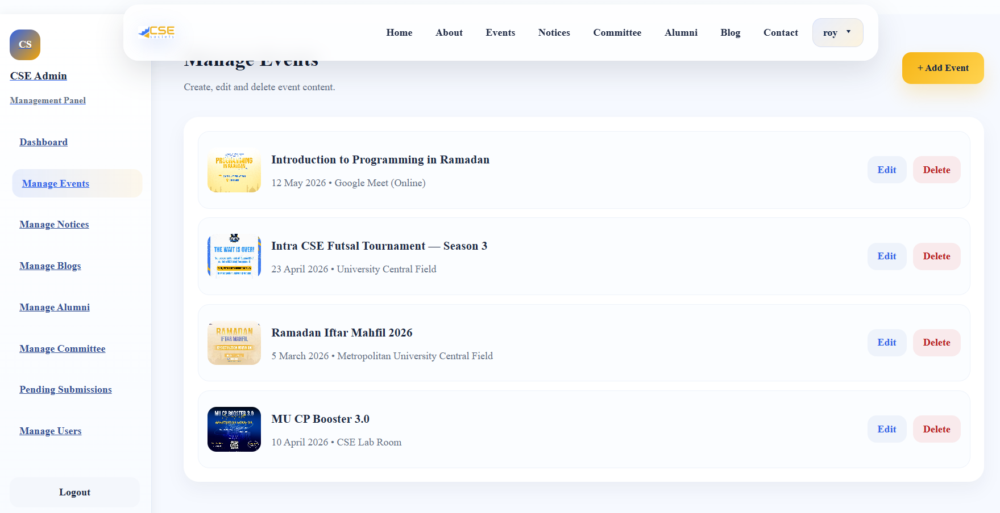

### Admin Manage Notice
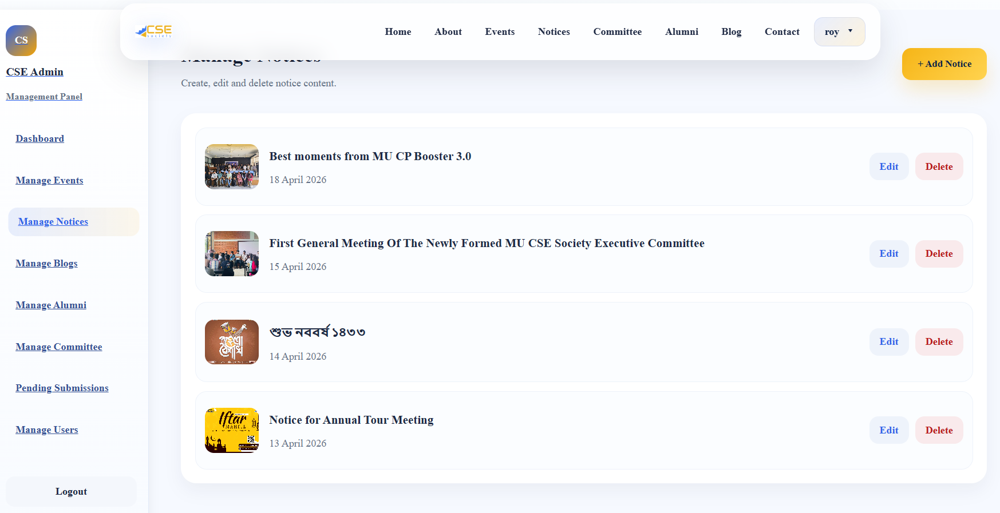

### Admin Manage Blog
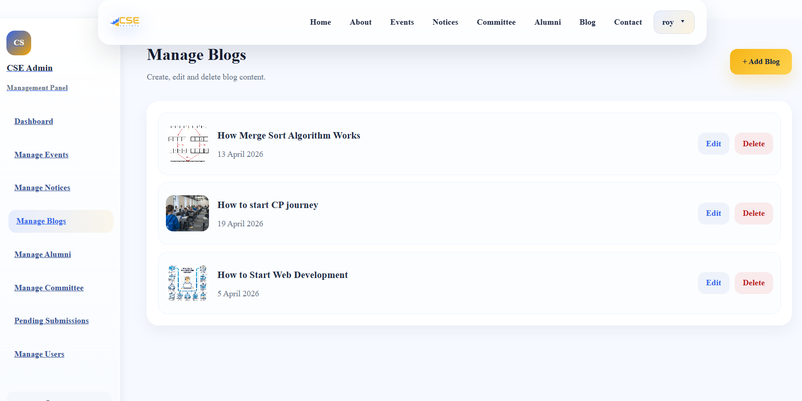

### Admin Manage Alumni
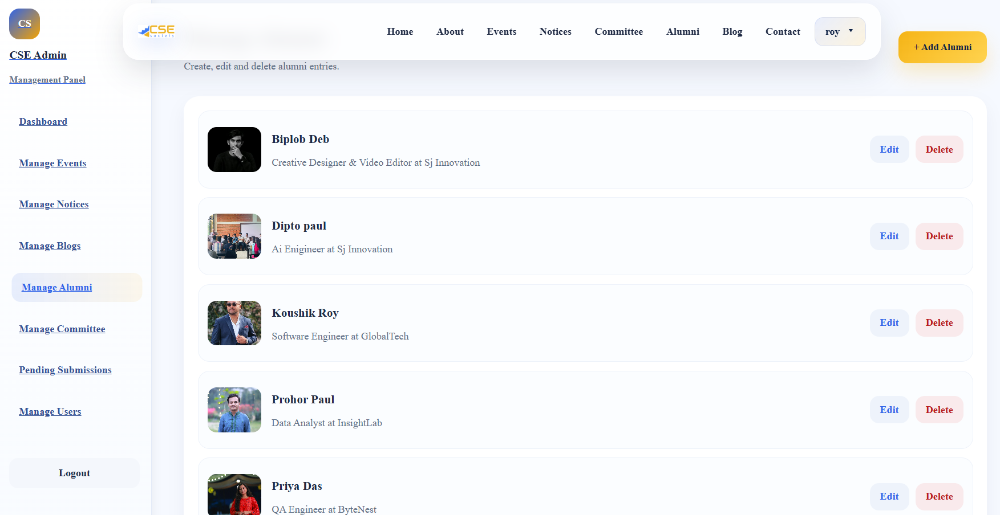

### Admin Manage Committee
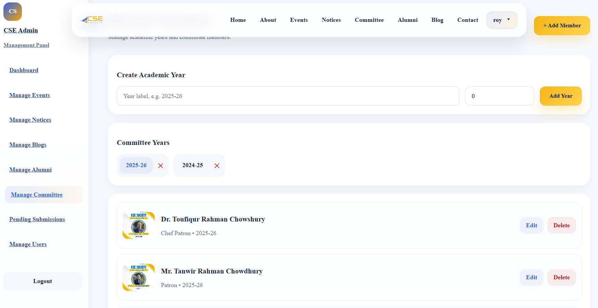

### Admin Manage Pending Submission
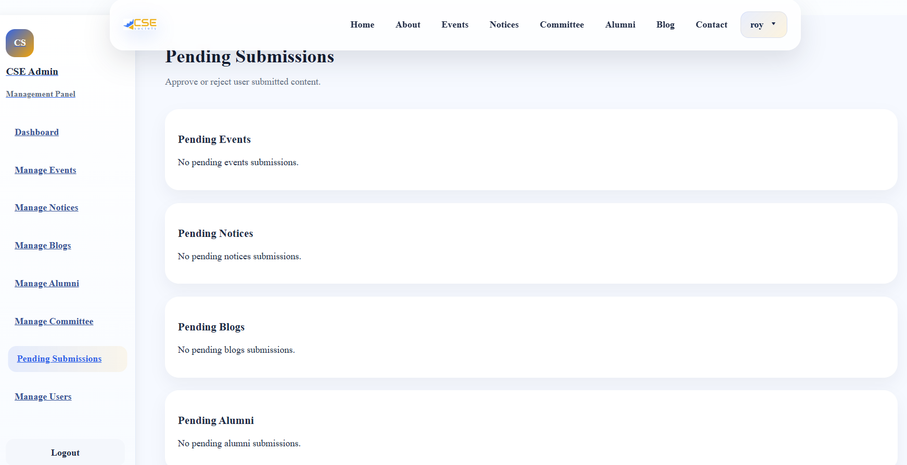

### Admin Manage Event


---

## Project Structure

```bash
MU_Cse_Society/
│
├── frontend/
│   ├── public/
│   ├── src/
│   │   ├── admin/
│   │   ├── components/
│   │   ├── pages/
│   │   ├── services/
│   │   ├── App.jsx
│   │   └── main.jsx
│   └── package.json
│
├── backend/
│   ├── core/
│   ├── config/
│   ├── media/
│   ├── manage.py
│   └── requirements.txt
│
└── README.md